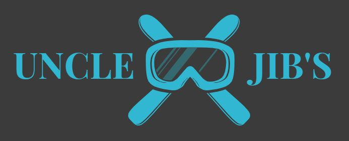

https://uncle-jibs.herokuapp.com/

# Welcome to Uncle Jib's!

## The Snow Sports Specialists

Here at Uncle Jib's we are a family run retailers who love snow and everything to do with it.
We are all about the experience here at Uncle Jib's and want to bring you the very best experience when using our site. We hope you 
all enjoy browsing and hope to see you again soon.

## Why was this site created?
Uncle Jib's webshop has been designed and built by Libby Winfield as a final project for the Code Institute Full Stack Web Development 
Diploma. The purpose of this shopping site is to allow for new customers to shop on a safe and secure site in order to shop for the latest
snowboards and equipment. Specifically aimed at customers who enjoy being outdoors in the snowy mountains looking for the highest quality 
and stylish snowboards to suit their riding needs.

## UX

### Business Goals
The goals for Uncle Jib's website on a business front are:
- Providing a professional online shop where users can easily find their way around the site.
- There are links to all social media to provide Uncle Jib's with a brand awareness for all it's customers.

### Visitor Goals
- Allows for shoppers to find the best snowboard for them, by providing descriptions and information relevant to each individual snowboard.
- Enjoy browsing for those who like to see what new products are being released.
- Ensures the users know what type of snowboarder they are. They can choose what their riding style is enabling them to find a suitable board.
- Buying from a trustworthy online dealer.

### What users expect, need and want
- The users need to be able to easily find selected items that are shown within the category on the navigation bar. 
- Having a clean and clear layout that allows user to easily navigate around the site.
- Ensure that the site is easy to use, not only on a desktop view but also mobile views and tablets.
- All information and images should be layed out in a clear manour to make easy reading.
- Have a working contact page to allow for users to contact the site owner when they have any questions that need answering.
- To be able to see what items are within their cart.
- Allow for users to log into the site to keep their contact details and payment information.

## Design Choices

## Icons
- There are many icons throughout the entire site to easily show what specific items represent. 
- - Within the footer section of the page there are two icons, Snapchat and Facebook. These two social media links lead the users 
onto those chosen platforms to allow users to spread brand awarenss. 
- - There is a search icon on the navigation bar to show users that they can add anything within the search bar to find a 
specific item. 
- - On the home page, on the 'Select a Snowboard Category' there are two icons, Snowflakes and  Snowman. These icons are placed on the 
snowboard categories to add some character to the cards.  
- - Within the actual site tab itself there is a small icon which represents the website logo.

## Colours
- Specific colours are shown and have been specifically chosen becuase they work well with each other.
- Background colour: #2c2e2f - Dark grey
- Headline colour: #2fb8ce - Light blue
- Text: #c5c5c5c - Dark white / Creme
- The use of dark white / creme on the dark grey background allows for users to easily read the text, as if white/#ffffff had been chosen there 
would be a bright contrast and would strain the users eyes when viewing the site.

## Styling
- There are specific styling additions to the majority of the buttons to allow for users to know when they are hovering on them. These buttons 
will turn from a light blue to dark blue to indicate that these will take you to other pages within the site. 
- Curved edges were chosen on buttons to make the site more user friendly. This is a common styling choice within bootstrap and is commonly 
used on sites such as Facebook and Instagram.

## wireframes
- All wireframes were hand drawn and were made 2/3x over to ensure I could create the best site possible within the assessed time period.
The wireframes can be found within the 'static' file under the name 'wireframes'.

## Pages
### Home Page
- On the Home page, it is designed to have a selection of three images all to do with snowy mountains, to scroll through these images simply press 
the indication arrows on the left and right side of the images. Below there is information about Uncle Jib's. Further down the pages shows 
all of the categories of snowboard riding styles which people can select from to suit their own needs. It states the category name, 
description, image and a button to direct the user to that specific category. At the bottom of this page, is a simple icon row which simply states 
there is 'Fast and Free Shipping', '24hr Customer Service' and 'Free Returns on all Orders'. 

### Nav bar
- Within the Nav bar there are selected pages I'd like the user to go to. These are the specific snowboard categories, which will provide a 
dropdown and render the specific categories. Besides this is the Contact page, where users can email the site provider. The About page is vital for 
users to know more about how the site originated and who is behind selling their goods. I decided to add the shopping cart as just an icon as it 
allowed for a more simple and minimal approach to the site. Within the middle of the nav bar is the registration/profile/login/logout.
These too have icons next to ther title to add an artistic approach. Finally there is the search bar. This is located to the far right of the 
navigation bar as it is set out of the way from the main navigation.

### Products 
- When typing into the URL `/products` it will return all the products even though they have a selected category. However, within the product app views.py, 
there are 3 views. `def product` will render a single product in lots of detail, `def all_products` which will only be rendered if /products is added 
into the URL and `category` which renders only the snowboards within a particular categegory which is defined within the products models.py 
under `CHOICE`.

### Cart 
- If the users shopping cart is empty, then the cart will return empty and no number icon on the cart icon. However, when there are items within the basket a 
small yellow icon and number will appear next to the cart to indicate how many items are in the cart. 
- When there are items added to the cart, a table will appear with the product picture, name, price, quantity and price and then the ammendment section for you to adjust your order.
Below this is the checkout station. The user is asked to review their cart order and if correct then proceed to purchase.
- This page has been designed where one item goes below the other. This is due to when ordering snowboards, it is very rare to order more than one.

### Checkout
- Once the user is at the checkout, their product image will appear with the name, price and quantity. They will be told in big text what the total amount to pay is and then be taken
 to the payment details form. Within this form is all the neccessary information for purchasing the products, ie. card details, address information etc. once submitted, there 
 will be a confirmation saying 'your order has been successful'.

### Search
- The search bar will only render an item if the name is spelt correctly and is within the database. If the item is not within the database then it will 
return a page stating 'The product cannot be found'.
- When searching for a specific item, use phrases common to snowboarding, ie. Jib, Camber, Bataleon etc. Try using brand names to filter your 
search (Bataleon, Burton, Salomon etc).

### About
- Here is where users can learn more about Uncle Jib's. There is text about their story and a map providing 
the location of their warehouse/shop for those who want to return items in person.
- At the end there is a section that provides the user with information on environmental features that Uncle jib's adhere to throughout their company.

### Delivery
- On this page, the user can find all the information and policy on delivering their item, if delivery is free and where we deliver within the world.

### Returns
- Users can access all the information on returning an item if needed. 
- At the bottom of the page if there is anything the that isnt specific to the user, there is a contact button below so they may email Uncle Jib's with their specific questions.

### Contact
- This contact service is fully functional and will send the email to the site owners personal email and will aim to get back to the user within 24hrs.

### Reviews
- When creating the reviews section within each individual product I chose to use a ForeignKey instead of a OneToOne relation key.
I chose to add a review system in to add some unique use for the user. They need to create an account and log in inorder to write a review on any 
product. If however, the user is not logged in then they can only see what reviews have been left.

### FAQs
- The most asked questions are highlighten in blue and the answers are beneath them. I used the blue to highlight the questions so users 
could quickly scan the page and find the most relevant question to them. At the bottom of the page I added a link to the contact form, so if a user couldn't find 
their questions they can simply and quickly email Uncle Jib's and get an answer back within 24hrs.

### Register
- Within this page, there is a large title saying 'Create An Account'. A form underneath asks for the user to enter in a valid email address, username, 
password x2. However, there is a link just below the title allowing users with existing acounts to sign in.

### Login
- Here there are simply 2 text forms displaying username and password. If the username and password are not correct it will return an error.

### Logout
- When the logout button is pressed, it logs the user out and renders the index page.

### Covid
- This page just describes what to do during Covid-19 ie. Staying inside, it states that there may be delays in shipping and returning 
items due to the virus.

## furture features
There are many future features I would like to implement as we progress to allow for a better user experience.
- Creating a 'like' system that all products will have. A user can simply 'like' a product and it will be sent to a wish list for future visits to 
the site.
- When a customer has purchased a snowboard from the website, an automatic email shall be sent to ensure them that their order is being 
